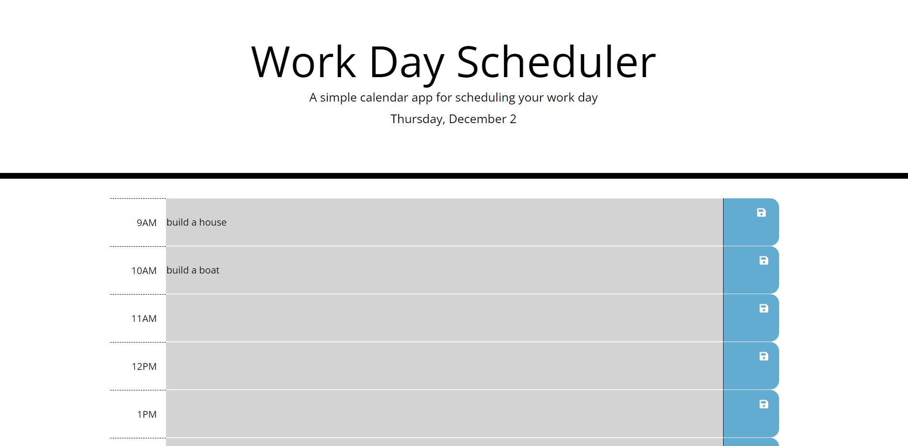

# Work Day Scheduler

## Description
The goal for this project was to use A third party API to help create a workday scheduler.  I chose to use the time functions in Day.js to create a workday scheduler that is responsive to the time of day.  The is project enabled me to programatically change HTML elements in javascript, use the API documentation to learn how to use it effectively, and allowed me to practice with other API's like bootstrap and jQuery.

## Built With
* HTML
* CSS
* JavaScript
* Third Party API's - Day.js, Bootstrap, jQuery, Iconic

## Website

Deployed Page: https://mirandal27.github.io/Work-Day-Scheduler/

## Credits
Miranda Lane
